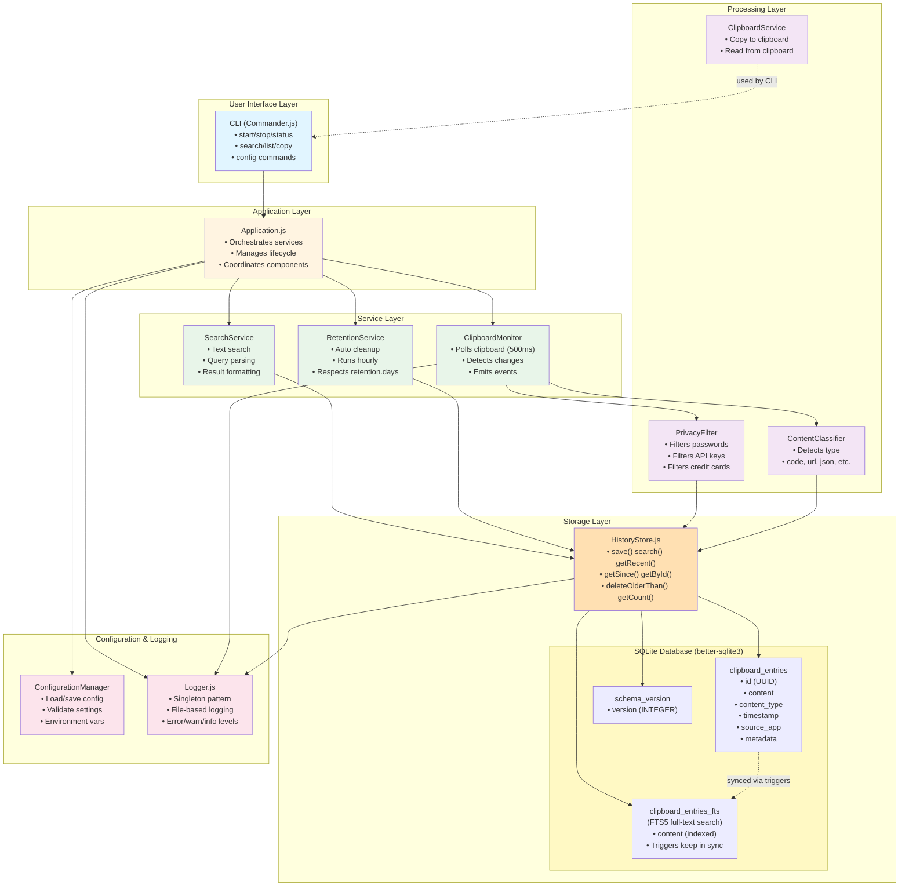
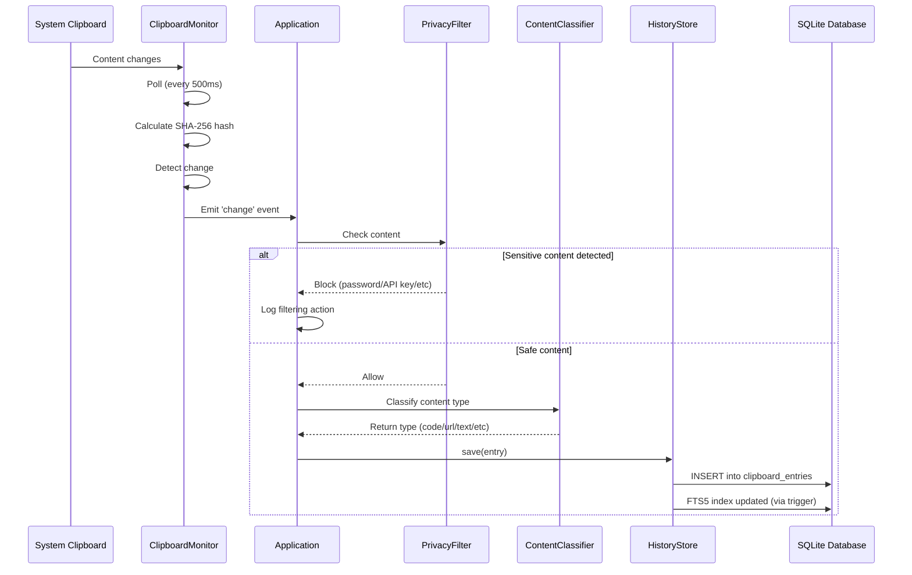
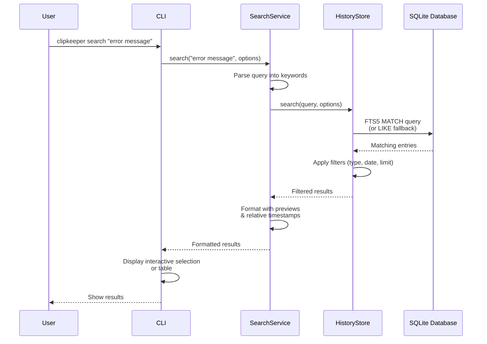
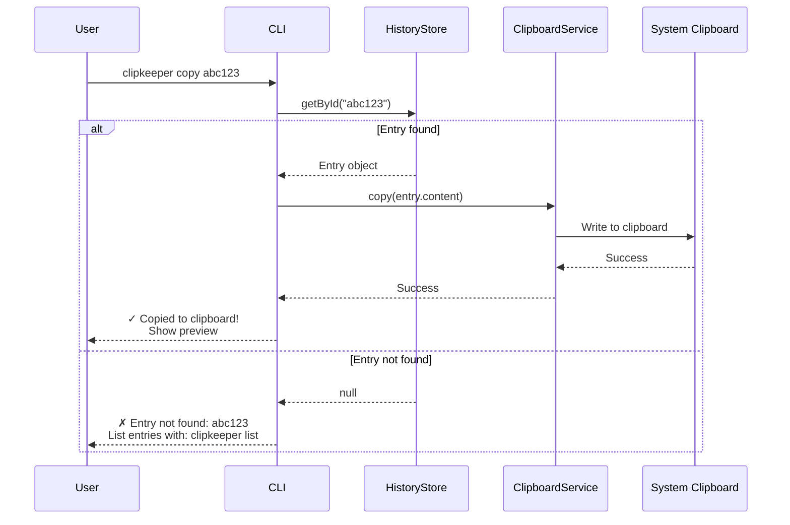
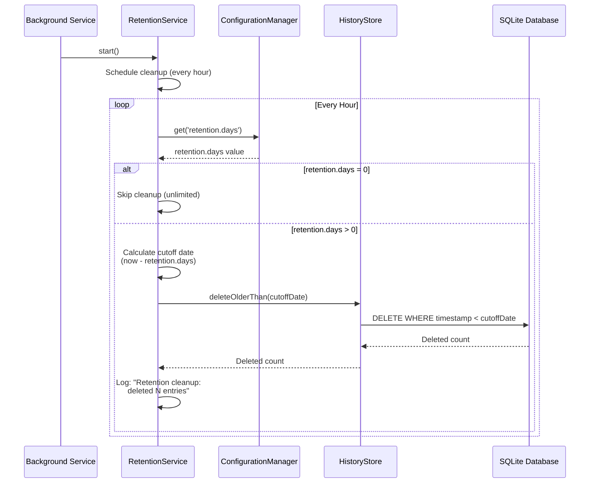

# clipkeeper Design Document

## Overview

clipkeeper is a privacy-first clipboard history manager that runs entirely on your local machine. It captures clipboard changes, stores them in a local SQLite database, and provides powerful search and retrieval capabilities through a CLI interface.

## Architecture

### High-Level Architecture



## Core Components

### 1. Application (Application.js)

**Purpose:** Main orchestrator that coordinates all services and manages the application lifecycle.

**Responsibilities:**
- Initialize all components (HistoryStore, ClipboardMonitor, Services)
- Start/stop background monitoring
- Handle clipboard change events
- Coordinate between components

**Key Methods:**
```javascript
async initialize()  // Set up all components
async start()       // Start monitoring and services
async stop()        // Stop all services
getStatus()         // Return current status
```

### 2. ClipboardMonitor (ClipboardMonitor.js)

**Purpose:** Continuously monitor the system clipboard for changes.

**Responsibilities:**
- Poll clipboard at configurable intervals (default: 500ms)
- Detect content changes using SHA-256 hashing
- Emit 'change' events when new content is detected
- Retry on access denied errors (100ms delay, 1 retry)
- Handle errors gracefully without stopping

**Key Features:**
- Event-driven architecture (extends EventEmitter)
- Automatic retry logic for clipboard access issues
- Efficient change detection using content hashing

### 3. HistoryStore (HistoryStore.js)

**Purpose:** Manage clipboard history storage in SQLite database.

**Responsibilities:**
- CRUD operations for clipboard entries
- Full-text search with FTS5 (with LIKE fallback)
- Date-based filtering
- Content type filtering
- Database migrations and schema versioning

**Key Methods:**
```javascript
save(entry)                    // Save new entry
search(query, options)         // Full-text search
getRecent(limit)               // Get recent entries
getSince(date, limit)          // Get entries since date
getById(id)                    // Get specific entry
deleteOlderThan(date)          // Delete old entries
getCount()                     // Total entry count
getCountByType()               // Count by content type
```

**Database Schema:**
```sql
-- Main table
CREATE TABLE clipboard_entries (
  id TEXT PRIMARY KEY,
  content TEXT NOT NULL,
  content_type TEXT NOT NULL,
  timestamp INTEGER NOT NULL,
  source_app TEXT,
  metadata TEXT
);

-- FTS5 full-text search (if available)
CREATE VIRTUAL TABLE clipboard_entries_fts USING fts5(
  content,
  content='clipboard_entries',
  content_rowid='rowid'
);

-- Schema versioning
CREATE TABLE schema_version (
  version INTEGER PRIMARY KEY
);
```

### 4. SearchService (SearchService.js)

**Purpose:** Coordinate search operations with filtering and result formatting.

**Responsibilities:**
- Parse search queries into keywords
- Call HistoryStore with appropriate filters
- Format results with previews and relative timestamps
- Handle empty queries gracefully

**Key Features:**
- Multi-keyword search (AND logic)
- Case-insensitive matching
- Result preview generation (first 100 chars)
- Relative timestamp formatting ("2 hours ago")

### 5. RetentionService (RetentionService.js)

**Purpose:** Automatically clean up old clipboard entries based on retention policy.

**Responsibilities:**
- Run cleanup every hour
- Respect `retention.days` configuration
- Delete entries older than retention period
- Log cleanup operations
- Support unlimited retention (retention.days = 0)

**Cleanup Flow:**
```
Every Hour
  ↓
Check retention.days config
  ↓
If 0: Skip cleanup
If > 0: Calculate cutoff date
  ↓
Delete entries older than cutoff
  ↓
Log deleted count
```

### 6. ClipboardService (ClipboardService.js)

**Purpose:** Handle copying entries back to system clipboard.

**Responsibilities:**
- Copy content to system clipboard
- Read current clipboard content
- Preserve exact content (no formatting changes)
- Handle errors gracefully

**Usage:**
- Used by CLI `copy` command
- Wraps clipboardy library for cross-platform support

### 7. ContentClassifier (ContentClassifier.js)

**Purpose:** Automatically detect content type of clipboard entries.

**Supported Types:**
- `text` - Plain text
- `code` - Programming code (JavaScript, Python, Java, etc.)
- `url` - HTTP/HTTPS URLs
- `json` - JSON data
- `xml` - XML documents
- `markdown` - Markdown formatted text
- `file_path` - File system paths
- `image` - Image data (Buffer or object with image property)

**Classification Logic:**
- Uses pattern matching and heuristics
- Checks for language-specific keywords
- Validates structure (JSON, XML)
- Prioritizes more specific types over generic ones

### 8. PrivacyFilter (PrivacyFilter.js)

**Purpose:** Detect and filter sensitive content to prevent it from being saved.

**Filtered Content Types:**
- Passwords (8+ chars, mixed case, numbers, symbols)
- Credit card numbers (validated with Luhn algorithm)
- API keys (Bearer tokens, sk-* prefixed keys)
- Private keys (PEM format: RSA, DSA, EC, OPENSSH)
- SSH keys (RSA, Ed25519)

**Features:**
- Configurable enable/disable
- Custom pattern support
- Secure logging (logs filtering action, not content)

### 9. ConfigurationManager (ConfigurationManager.js)

**Purpose:** Manage application configuration with validation.

**Configuration Storage:**
- Windows: `%APPDATA%\clipkeeper\config.json`
- macOS: `~/Library/Application Support/clipkeeper/config.json`
- Linux: `~/.config/clipkeeper/config.json`

**Key Settings:**
```javascript
{
  retention: {
    days: 30  // 0 = unlimited
  },
  monitoring: {
    pollInterval: 500,  // milliseconds
    autoStart: false
  },
  privacy: {
    enabled: true,
    customPatterns: []
  },
  storage: {
    dataDir: "<platform-specific>",
    dbPath: "<dataDir>/clipboard-history.db"
  }
}
```

### 10. CLI (cli.js)

**Purpose:** Command-line interface for user interaction.

**Commands:**
- `start` - Start background service
- `stop` - Stop background service
- `status` - Show service status and statistics
- `list` - List clipboard history with filters
- `search` - Search clipboard history
- `copy` - Copy entry back to clipboard
- `clear` - Clear all history
- `config` - Manage configuration

**Interactive Mode:**
- Arrow keys to navigate entries
- Enter to copy selected entry
- Cancel option at top of list
- Shows preview and relative timestamps

## Data Flow

### Clipboard Capture Flow



### Search Flow



### Copy Flow



### Retention Cleanup Flow



## Performance Characteristics

### Search Performance
- **Target:** < 500ms for 10,000+ entries
- **Achieved:** 1-2ms average with FTS5
- **Fallback:** 50-100ms with LIKE queries
- **Optimization:** FTS5 full-text index, prepared statements

### Storage Performance
- **Insert:** < 5ms per entry
- **Retrieval:** < 1ms for single entry
- **Bulk operations:** Batched for efficiency

### Memory Usage
- **Baseline:** ~30-50 MB
- **Per 10,000 entries:** ~10-20 MB
- **Optimization:** Streaming for large result sets

## Security & Privacy

### Privacy-First Design
1. **Local-only storage** - No cloud sync, no external services
2. **Automatic filtering** - Sensitive content blocked by default
3. **Secure permissions** - Config files have restricted access
4. **No telemetry** - No usage tracking or analytics

### Sensitive Content Detection
- Pattern-based detection with high accuracy
- Luhn algorithm for credit card validation
- Configurable custom patterns
- Secure logging (never logs actual sensitive content)

### Data Storage Security
- SQLite database with file-level permissions
- Configuration files with restricted access (0600 on Unix)
- No encryption at rest (relies on OS-level encryption)

## Testing Strategy

### Unit Tests (443 passing)
- All core components have comprehensive unit tests
- Edge cases and error conditions covered
- Mock external dependencies (clipboard, filesystem)

### Integration Tests
- End-to-end workflows tested
- Service lifecycle management
- Database migrations
- CLI command execution

### Performance Tests
- Search performance validation
- Large dataset handling (10,000+ entries)
- Memory usage monitoring
- Cleanup operation timing

## Migration & Versioning

### Database Migrations
- Schema version tracking in `schema_version` table
- Automatic migration on version mismatch
- FTS5 detection and graceful fallback
- Backward compatible migrations

### Version History
- v0.1.0: Initial release with basic clipboard monitoring
- v0.3.0: Added text search, copy functionality, retention cleanup

## Future Enhancements

### v0.4.0 (Planned)
- Date range filtering (--until flag)
- Semantic search with natural language
- LLM embedding integration
- Vector similarity search

### v0.5.0 (Planned)
- Optional encrypted sync across devices
- GUI application
- Plugin system
- Browser extensions

## Dependencies

### Core Dependencies
- **better-sqlite3** - Fast SQLite database
- **clipboardy** - Cross-platform clipboard access
- **commander** - CLI framework
- **@inquirer/prompts** - Interactive CLI prompts

### Development Dependencies
- **fast-check** - Property-based testing
- Node.js built-in test runner

## Platform Support

### Supported Platforms
- Windows 10/11
- macOS 10.15+
- Linux (Ubuntu, Debian, Fedora, Arch)

### Requirements
- Node.js 18+
- SQLite 3.x (bundled with better-sqlite3)
